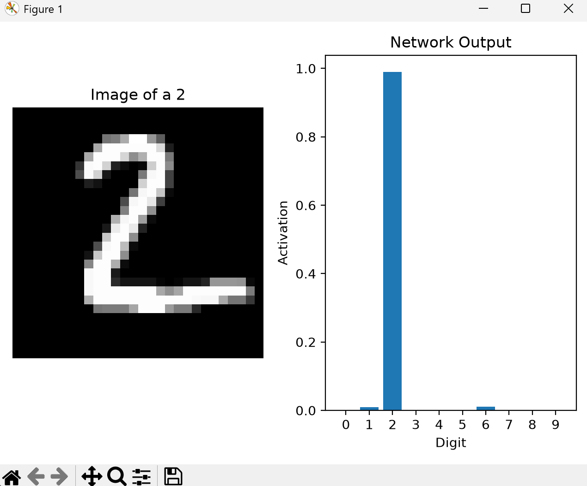

# Neural Network From Scratch

[](https://www.python.org/)
[](https://numpy.org/)
[](https://matplotlib.org/)
[](http://yann.lecun.com/exdb/mnist/)
[]()

A lightweight, fully modular deep feedforward neural network (multilayer perceptron) built entirely **from first principles** in Python using only **NumPy**. No PyTorch, TensorFlow, Keras, or autograd libraries were used—every forward pass, activation function, cost calculation, and backpropagation gradient is implemented by hand to understand perceptrons and backpropagation from the ground up.

Trained and evaluated on the classic **MNIST handwritten digit dataset**, achieving **~94.2% accuracy** on the 10,000-image test set with a compact `784 -> 16 -> 16 -> 10` architecture.

---

## 📐 Network Architecture & Theory

The complete network layout and mathematical derivation sketched out from the ground up:

<p align="center">
  
</p>

---

## 📸 Visual Demo

When evaluating predictions in `main.py`, the network displays the raw test image alongside a real-time bar chart of neuron activations across digits 0–9:

<p align="center">
  
</p>

---

## ✨ Features

- **Pure NumPy Implementation**: Zero dependency on black-box ML frameworks. All linear algebra operations, tensor multiplications, and derivatives are explicitly coded.
- **Custom Binary IDX Data Loader**: Built-in binary file reader (`data_loader.py`) that unpacks big-endian MNIST raw byte files using Python's standard `struct` library.
- **Modular Multi-Layer Architecture**: Dynamically configure networks with any number of layers and hidden units (e.g., `NeuralNetwork([784, 64, 32, 10])`).
- **Exact Analytical Backpropagation**: Full manual implementation of the multivariable calculus chain rule for computing weight and bias gradients across arbitrary layers.
- **Model Checkpointing**: Save and load trained model parameters seamlessly using NumPy's compressed `.npz` format (`params.npz`).
- **Interactive Matplotlib Inspector**: Visually inspect digit images and observe the network's confidence distribution across all 10 output classes.

---

## 🧠 Mathematical Foundations

### 1. Network Topology
The default configuration is a 4-layer fully connected network:
- **Input Layer**: 784 neurons (flattened $28 \times 28$ grayscale pixels, normalized to $[0, 1]$).
- **Hidden Layer 1**: 16 neurons (Sigmoid activation).
- **Hidden Layer 2**: 16 neurons (Sigmoid activation).
- **Output Layer**: 10 neurons representing digit classes $0$ through $9$.

### 2. Forward Propagation
For each layer $l$:
$$\mathbf{z}^{[l]} = \mathbf{W}^{[l]} \mathbf{a}^{[l-1]} + \mathbf{b}^{[l]}$$
$$\mathbf{a}^{[l]} = \sigma(\mathbf{z}^{[l]}) = \frac{1}{1 + e^{-\mathbf{z}^{[l]}}}$$

Where:
- $\mathbf{W}$ is the weight matrix initialized via scaled Gaussian noise: $\mathcal{N}(0, 1) \times 0.01$.
- $\mathbf{b}$ is the bias vector initialized to zeros.
- $\sigma(z)$ is the standard sigmoid activation function with derivative $\sigma'(z) = \sigma(z)(1 - \sigma(z))$.

### 3. Loss Function
The network utilizes the Mean Squared Error (MSE) loss:
$$C = \sum_{j=0}^{9} (a_j^{[L]} - y_j)^2$$
where $\mathbf{y}$ is the one-hot encoded ground truth label vector.

### 4. Backpropagation & Parameter Updates
The error gradient $\boldsymbol{\delta}$ is propagated backwards layer-by-layer:

- **Output Layer**:
  $$\boldsymbol{\delta}^{[L]} = 2(\mathbf{a}^{[L]} - \mathbf{y}) \odot \sigma'(\mathbf{z}^{[L]})$$

- **Hidden Layers**:
  $$\boldsymbol{\delta}^{[l]} = \left(\boldsymbol{\delta}^{[l+1]} \mathbf{W}^{[l+1]}\right) \odot \sigma'(\mathbf{z}^{[l]})$$

- **Gradients**:
  $$\frac{\partial C}{\partial \mathbf{b}^{[l]}} = \boldsymbol{\delta}^{[l]}, \quad \frac{\partial C}{\partial \mathbf{W}^{[l]}} = \boldsymbol{\delta}^{[l]} \otimes \mathbf{a}^{[l-1]}$$

- **Stochastic Gradient Descent (SGD) Update**:
  $$\mathbf{W}^{[l]} \leftarrow \mathbf{W}^{[l]} - \alpha \frac{\partial C}{\partial \mathbf{W}^{[l]}}$$
  $$\mathbf{b}^{[l]} \leftarrow \mathbf{b}^{[l]} - \alpha \frac{\partial C}{\partial \mathbf{b}^{[l]}}$$

> [!NOTE]
> For complete handwritten derivations, architectural diagrams, and proofs, see [`neuralnetnotes.pdf`](neuralnetnotes.pdf).

---

## 📁 Project Structure

```text
neural-net-from-scratch/
├── MNIST/                               # Raw MNIST binary dataset files
│   ├── t10k-images-idx3-ubyte           # 10,000 test images (binary IDX)
│   ├── t10k-labels-idx1-ubyte           # 10,000 test labels (binary IDX)
│   ├── train-images-idx3-ubyte          # 60,000 training images (binary IDX)
│   └── train-labels-idx1-ubyte          # 60,000 training labels (binary IDX)
├── 2026-09-06 22-47.jpg                 # Handwritten network sketch and layer derivation
├── data_loader.py                       # Binary IDX parser and one-hot encoding
├── layer.py                             # Dense Layer definition, activations, and backprop
├── network.py                           # Multi-layer NeuralNetwork container
├── params.py                            # Save/load utilities for weights & biases (.npz)
├── train.py                             # SGD training loop and cost computation
├── main.py                              # Model evaluation and interactive visualizer
├── params.npz                           # Pretrained model weights & biases (~94.2% test accuracy)
├── modeldemo.png                        # Demo screenshot of model output visualization
├── neuralnetnotes.pdf                   # Theoretical notes and mathematical derivations
├── requirements.txt                     # Project dependencies (NumPy & Matplotlib)
└── README.md                            # Project documentation
```

---

## 🚀 Getting Started

### 1. Prerequisites
- Python 3.8 or higher installed on your system.

### 2. Clone the Repository
```bash
git clone https://github.com/bryanmsh/neural-net-from-scratch.git
cd neural-net-from-scratch
```

### 3. Create a Virtual Environment (Optional but Recommended)
```bash
# On macOS / Linux:
python3 -m venv venv
source venv/bin/activate

# On Windows (PowerShell):
python -m venv venv
.\venv\Scripts\Activate.ps1
```

### 4. Install Dependencies
```bash
pip install -r requirements.txt
```

---

## 💻 Usage

### Evaluate & Visualize Predictions
To run the interactive visualizer using the pre-trained weights in `params.npz`:

```bash
python main.py
```

This will:
1. Load the MNIST test set (10,000 images).
2. Load the trained network parameters from `params.npz`.
3. Compute the average test cost.
4. Display each test sample alongside its predicted activation bar chart. Close the Matplotlib window to advance to the next sample.

### Train a Model
To retrain the neural network on the 60,000 MNIST training images:

```bash
python train.py
```

Training parameters can be configured inside `train.py`:
```python
network = nn.NeuralNetwork([784, 16, 16, 10])
learning_rate = 0.03
num_epochs = 5

train(network, training_images, training_labels, learning_rate, num_epochs)
```
Trained parameters will automatically be saved to `params.npz`.

### Programmatic Usage
You can easily import and use the network in your own scripts:

```python
import numpy as np
import network as nn
from params import load_params

# Initialize a custom architecture
model = nn.NeuralNetwork([784, 16, 16, 10])

# Load weights
load_params(model, "params.npz")

# Run inference on a flattened 28x28 normalized image
sample_image = np.random.rand(784)
output_activations = model.forward(sample_image)
predicted_digit = np.argmax(output_activations)

print(f"Predicted Digit: {predicted_digit}")
```

---

## 📊 Benchmark Results

| Model Architecture | Activation | Optimizer | Epochs | Test Accuracy |
| :--- | :--- | :--- | :--- | :--- |
| `[784, 16, 16, 10]` | Sigmoid | SGD ($\alpha = 0.03$) | 5 | **~94.2%** |

---

## 🗺️ Roadmap

- [ ] Implement **ReLU** / **LeakyReLU** activations to alleviate vanishing gradients.
- [ ] Implement **Softmax** on the output layer for proper multi-class probability distributions.
- [ ] Switch to **Categorical Cross-Entropy** loss.
- [ ] Add **Mini-batch Gradient Descent** and vectorization for accelerated training.
- [ ] Add interactive canvas / drawing pad to test custom hand-drawn digits in real time.

---

## 📜 License

This project is open source and available under the [MIT License](LICENSE).
